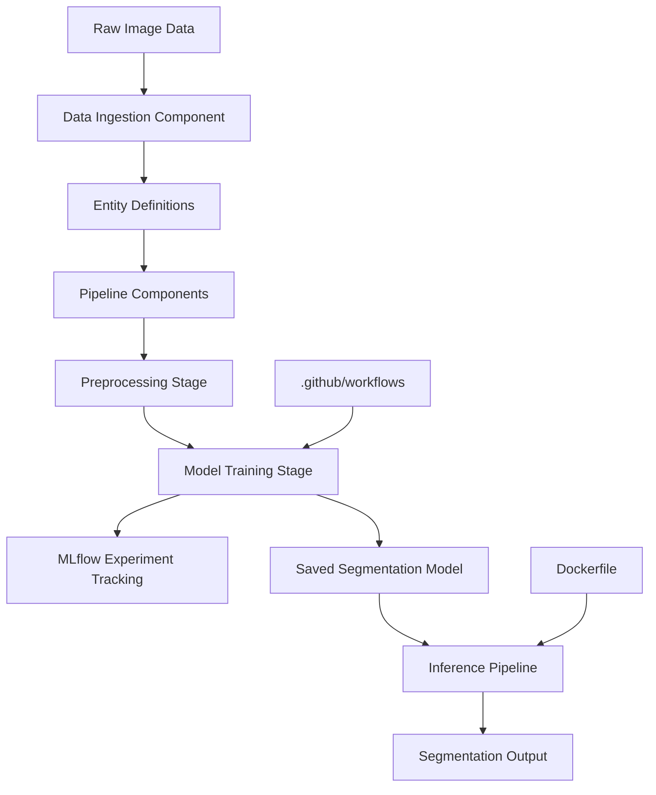

# Cellseg — Cell Segmentation ML Pipeline

Modular end-to-end cell segmentation pipeline built with an MLOps-style architecture. Covers data ingestion through model inference with MLflow experiment tracking and Dockerized deployment.

**Engineering concept:** MLOps pipeline design, modular ML component architecture, containerized ML inference, experiment tracking.

## Architecture

## Tech Stack

| Layer                 | Technology                            |
| --------------------- | ------------------------------------- |
| Language              | Python 3.x                            |
| Model                 | YOLOv8 (segmentation variant)         |
| Experiment Tracking   | MLflow                                |
| Containerization      | Docker                                |
| CI/CD                 | GitHub Actions                        |
| Pipeline Architecture | Modular component-based MLOps pattern |
| License               | MIT                                   |

## Project Structure

├── .github/workflows/        # CI/CD pipeline
├── cellSegmentation/         # Core segmentation module
│   ├── constants/            # Pipeline constants
│   ├── entity/               # Data entity definitions
│   ├── components/           # Individual pipeline components
│   └── pipelines/            # End-to-end pipeline orchestration
├── data/                     # Raw and processed datasets
├── research/                 # Experiment notebooks
├── runs/segment/             # MLflow run outputs
├── app.py                    # Application entry point
├── Dockerfile
└── README.md

## How the System Works
1. Raw cell images are ingested through the data ingestion component
2. Entity definitions enforce consistent data schemas across stages
3. Each pipeline component handles a discrete step: preprocessing, training, evaluation
4. MLflow tracks all experiment runs, metrics, and model artifacts
5. Best model is saved and served via the inference pipeline
6. Docker containerizes the full inference service for deployment

## How to Run Locally

git clone https://github.com/Jagmohan-Prajapati/Cellseg.git  
cd Cellseg  

### Without Docker
pip install -r requirements.txt  
python app.py  

### With Docker
docker build -t cellseg .  
docker run -p 5000:5000 cellseg  

## MLflow Tracking
Experiment runs are logged under runs/segment/. To view the MLflow dashboard:  
mlflow ui  

Then open http://localhost:5000 to view run metrics, parameters, and model artifacts.  

## Example Usage
python app.py --input data/sample_cell.jpg  

###Output:
Segmentation complete.  
Cells detected: 24  
Confidence avg: 0.91  
Output saved to: runs/segment/output_001.jpg  
